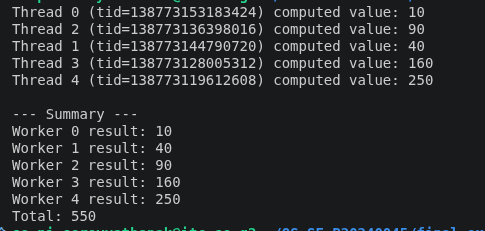
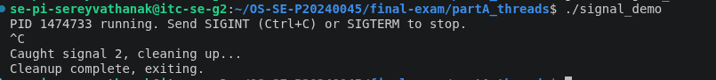
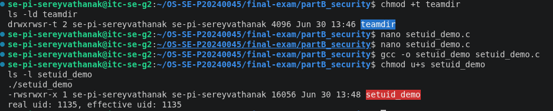
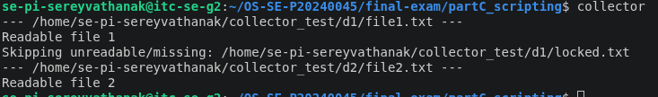
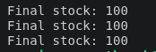
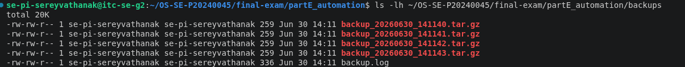

# Final Exam — Pi sereyvathanak

<!-- ===== COVER SHEET — required first section. Fill EVERY line. ===== -->
0```
Student name: Pi sereyvathanak
Student ID: P20240045
Server username: se-pi-sereyvathanak
Exam scenario value (COMPANY / PRODUCT): OrbitWorks
Date & start time: 1-3
AI assistant used (name/none): chatgpt and claude
```

> Exact commands per part are in `commands.md`. Live-curveball answers are in `live_mods.md`.
> Replace every `<...>` below. Keep answers tied to **your own** scenario numbers.

---

## Part A — Threads, Kernel Mapping & Signals

**Screenshots**




**Written (one short answer)**

- **Why does a worker thread's joined result reach the main thread, but a forked
  child's value would not?**
  Threads share one address space, so when the main thread joins a worker, it reads
  the worker's result directly from shared memory. A forked child gets a separate,
  copy-on-write copy of the process's address space, so any value it computes only
  exists in its own copy — it never reaches the parent without explicit IPC (pipes,
  shared memory, etc.).

**Anything not completed:** none

---

## Part B — Files, Permissions & Special Bits

**Screenshot**



**Written (one short answer)**

- **Translate your private file's final octal mode into the 9-char symbolic string**
  (e.g. `600` → `rw-------`).
  octal `600` → `rw-------`

**Anything not completed:** none

---

## Part C — Bash Scripting, PATH & Safe File Scanning

**Screenshot**



**Written (one short answer)**

- **Why did `greeter` fail to run by name before you added your `bin` directory to
  PATH?**
  The shell only resolves a bare command name by searching the directories listed in
  `$PATH`. Before `~/bin` was added to `PATH`, the shell had no entry pointing at the
  directory containing `greeter`, so it couldn't find it by name — it could only be
  run with an explicit path like `./greeter` or `~/bin/greeter`. Adding `~/bin` to
  `PATH` let the shell locate and run it by name alone.

**Anything not completed:** none

---

## Part D — Concurrency, a Race Condition & File Locking

**Screenshot**



**Written (one short answer)**

- **Why did the unpatched `swarm` sometimes leave more stock than the correct final
  value (with `150` stock and `50` concurrent buyers)?**
  All 50 buyer processes ran concurrently and many of them read the same stale stock
  value before any of them had written their decrement back (a classic
  read-modify-write / lost-update race). When several processes overwrite each
  other's update instead of stacking, fewer decrements actually take effect than the
  number of purchases that occurred, so the final stock ends up higher than the
  correct value of 100.

**Anything not completed:** The race was reproducible — unpatched runs returned 139,
143, 137, and 135 instead of the correct 100. D3's lock is what's graded, and it
consistently produced exactly 100 on every patched run.

---

## Part E — Backups, Archiving & cron Automation

**Screenshot**



**Written (one short answer)**

- **Archiving vs compression — which one actually shrank the bytes, and why?**
  `tar` only archives — it bundles multiple files into a single file without changing
  the total byte count. The `-z` flag (gzip) is what actually compresses the data and
  shrinks the size; the size reduction comes from compression, not the archiving step.

**Anything not completed:** none