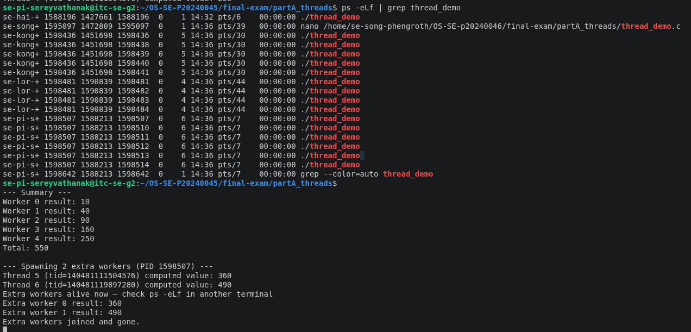
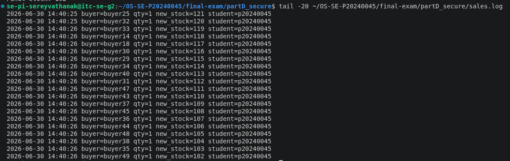
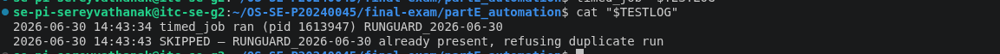

# live_mods.md — Live Modification (curveball) answers

> Released once, late in the exam. **Three curveballs: A, D, E.** For EACH, give: the
> announced instruction, the exact command(s) you ran, the **live value(s)** you acted
> on (your PID / stock / timestamp), and the screenshot. An answer that ignores your
> issued value, or that could have been written *before* the announcement, scores zero.

---

## Curveball A — extra worker(s) that start after the others join

- **Issued value:** 2 extra worker(s)
- **Announced instruction:** Edit `thread_demo.c` to spawn 2 extra workers that start
  only after the original 5 have joined; show the new LWP(s) appear in the mapping
  then disappear.
- **Live value(s) I acted on:** base PID = 1598507; original 5 worker LWPs (1598510–
  1598514) joined and exited before the extras spawned; extra workers ran as
  tid=140481111504576 and tid=140481119897280, computing values 360 and 490.
- **Commands:**

```bash
cd ~/OS-SE-P20240045/final-exam/partA_threads
nano thread_demo.c
# added 2 extra pthread_create() calls after the original join loop, printing
# the PID, then sleep(6) before joining the extras
gcc -pthread -o thread_demo thread_demo.c
./thread_demo &
ps -eLf | grep thread_demo
```

- **Screenshot:**



---

## Curveball D — per-buyer purchase cap

- **Issued value:** cap = 8
- **Announced instruction:** Add a per-buyer purchase cap to `buy_vault_token` —
  reject any single order above 8; re-run `swarm` and show the locked result respects
  the cap and stays consistent.
- **Live value(s) I acted on:** stock before = 150; two buyers in the swarm requested
  qty=10 (above the cap of 8) and were rejected before touching stock; all other 48
  buyers requested qty=1 and succeeded; final stock = 102 (150 − 48 successful
  purchases), confirming the lock kept the result deterministic even with rejected
  high-qty orders mixed in.
- **Commands:**

```bash
cd ~/OS-SE-P20240045/final-exam/partD_secure
nano ~/bin/buy_vault_token
# added MAX_PER_BUYER=8 check before the locked critical section
nano ~/bin/swarm
# set 2 buyers to request qty=10 (above cap), rest request qty=1
echo 150 > stock.txt
swarm
tail -20 ~/OS-SE-P20240045/final-exam/partD_secure/sales.log
```

- **Screenshot:**


---

## Curveball E — idempotent timed_job

- **Issued value:** token = `RUNGUARD`
- **Announced instruction:** Make `timed_job` idempotent using the token `RUNGUARD`
  — it must refuse to run if the token for today is already in its log; trigger it
  twice and prove the 2nd was skipped.
- **Live value(s) I acted on:** today's marker line = `RUNGUARD_2026-06-30`; 1st
  trigger at 14:34:34 wrote `timed job ran (pid 1613947) RUNGUARD_2026-06-30`; 2nd
  trigger at 14:34:43 was skipped, writing `SKIPPED — RUNGUARD_2026-06-30 already
  present, refusing duplicate run`
- **Commands:**

```bash
cd ~/OS-SE-P20240045/final-exam/partE_automation
nano ~/bin/timed_job
# added a grep check for "${TOKEN}_${TODAY}" in the target log file; if found,
# writes a SKIPPED line and exits 0 instead of re-running
chmod +x ~/bin/timed_job
TESTLOG=~/OS-SE-P20240045/final-exam/partE_automation/logs/live_e_test.log
rm -f "$TESTLOG"
timed_job "$TESTLOG"      # 1st run at 14:34:34 — wrote normal "ran" line, pid 1613947
timed_job "$TESTLOG"      # 2nd run at 14:34:43 — detected token present, SKIPPED
cat "$TESTLOG"
```

- **Screenshot:**

