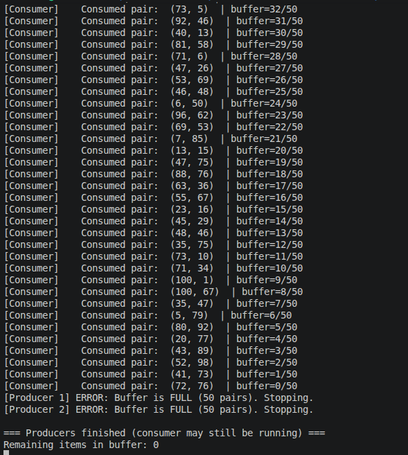
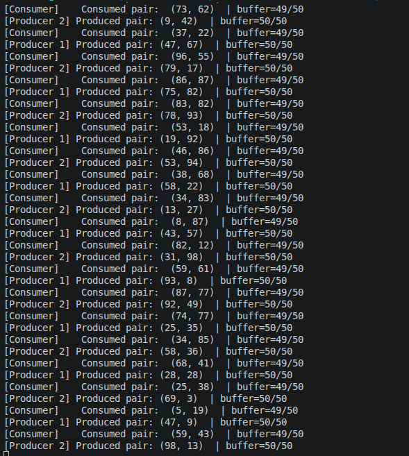
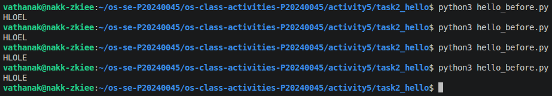
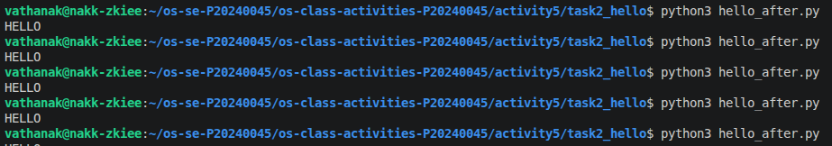

# Class Activity 5 - Semaphores

- **Student Name:** Pi sereyvathanak
- **Student ID:** P2024004
- **Programming Language Used:** Python

---

## Task 1A: Particle Pair Buffer Before Semaphores

- What error or incorrect behavior appeared: Break at 50 and the producer can't reach 50 (Race condtion)
- Why did this happen without semaphore protection: 

---

## Task 1B: Particle Pair Buffer After Semaphores

- Number of producer machines: 2
- Buffer capacity: 50
- Semaphores used: space, lock, signal
- Produced pair count shown in screenshot: 32
- Packaged pair count shown in screenshot: 32
- Did any error appear during normal operation? no

---

## Task 2A: HELLO Before Semaphores

- Output before semaphore ordering: HLOE
- Why this output can be wrong or unpredictable:
Each letter is printed by a separate thread, and without semaphores, the OS scheduler decides which thread runs first. Since there is no enforced order, threads can execute in any sequence — meaning O might print before H, or two Ls might appear consecutively before E. The output is non-deterministic and changes between runs.
---

## Task 2B: HELLO After Semaphores

- Processes 	3
- Semaphores used: wait, signal
- Final output: Hello

---

## Questions

1. In Task 1, why does a producer need to wait before adding a pair to the buffer?
producer must wait when the buffer is full. If it adds a pair without waiting, it will overwrite existing data that hasn't been consumed yet, causing data loss. The semaphore (often called empty_slots) tracks how many slots are available, and the producer blocks until a slot opens up.
2. In Task 1, why does the consumer need to wait before removing a pair from the buffer?
The consumer must wait when the buffer is empty. If it tries to remove a pair from an empty buffer, it will read garbage or invalid data. The semaphore (often called full_slots) tracks how many pairs are ready to consume, and the consumer blocks until at least one pair is available.
3. Which semaphore protects the critical section in your particle buffer program?
mutex semaphore (initialized to 1) protects the critical section — the actual read/write access to the shared buffer. Without it, two threads could simultaneously modify the buffer index or data, causing a race condition even when empty_slots and full_slots are used correctly.
4. How does your program verify that `P1` and `P2` belong to the same pair?
assigns both particles the same pair ID (e.g., a shared counter incremented after each complete pair is produced). The producer waits until both P1 and P2 are generated before placing the pair into the buffer as a single unit, ensuring they are always stored and consumed together.
5. In Task 2, why can the program print letters in the wrong order without semaphores?
Without semaphores, each thread or process runs independently and is scheduled by the OS at unpredictable times. The thread printing E might run before the thread printing H finishes, resulting in output like EHLOL or OHELL. There is no mechanism to enforce ordering, so the output is non-deterministic.
6. Which semaphore or synchronization step forces `H` to print before `E`, `L`, `L`, and `O`?
chain of semaphores enforces the order. After H is printed, it signals a semaphore that E is waiting on. After E prints, it signals the semaphore for the first L, and so on. Each thread waits on a semaphore that only gets released by the previous letter's thread — creating a strict sequential dependency: H → E → L → L → O.
7. What could cause deadlock in either of your simulations?
A thread holds a mutex and then tries to acquire another semaphore that will never be signaled (e.g., the buffer is full but the consumer is also blocked waiting for the mutex the producer holds).
In Task 2, if two threads each wait on each other's semaphore — neither can proceed.
Acquiring semaphores in inconsistent order across threads is the most common cause. Always acquire locks in the same order and always signal after the critical section to prevent this.

---

## Reflection

_What did these simulations teach you about using semaphores for shared resources and ordered execution?_
These simulations revealed how easily concurrent programs break without proper synchronization — and how semaphores provide an elegant solution to two fundamentally different problems.
In Task 1, working with the particle pair buffer showed me that shared resources require protection on two levels: first, a counting semaphore to track availability (how many slots are free or full), and second, a mutex to guard the access itself. Without both, even a well-intentioned producer can corrupt data simply by writing at the wrong moment. The race condition — where the count broke at 50 and the producer couldn't finish — made the problem concrete and visible, not just theoretical.
In Task 2, the HELLO ordering problem taught me that semaphores aren't only about preventing bad access — they can also choreograph execution. By chaining semaphores so each letter releases the next one, I turned chaotic parallel threads into a predictable sequence. This is a powerful insight: synchronization is not just about locks, but about communication between threads.