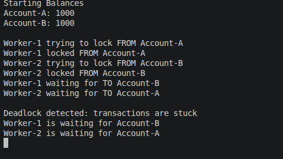
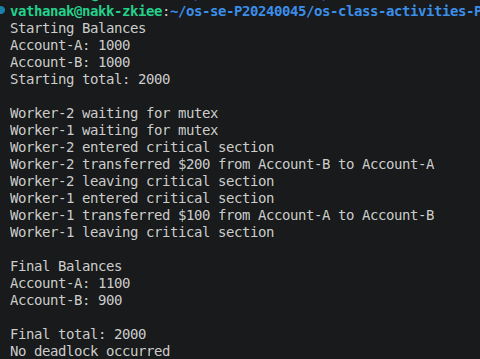

# Class Activity 6 - Deadlock Simulation

- **Student Name:** Pi sereyvathanak
- **Student ID:** P20240045
- **Programming Language Used:** Java
---

## Task 1: Deadlock Version

- Shared resources: Account A and Account B
- Transaction 1: Transfer 100$ from Account A to account B
- Transaction 2:  Transfer 200$ from Account B to account A
- Deadlock message shown: Deadlock detected: transactions are stuck
- Explanation of why the program got stuck: because each worker wait for each other. one worker suppose to finish the task and release so that the other worker can continue the work. but they are still acquire.

---

## Task 2: Deadlock Prevention Version

- Prevention strategy used: mutex lock
- Semaphore mutex initial value: 1
- Starting total: 2000
- Final total: 2000
- Did both transfers complete? Yes 
- Why no deadlock occurred: because when worker 1 start the task we use mutex lock. therefore worker 2 even they start the thread at the same time, it still have to wait for the first worker to finish the task.

---

## Questions

1. What are the two shared resources in your bank transaction simulation?
They share account
2. Which line or section of your Task 1 program creates hold-and-wait?
from.lock.acquire();

Thread.sleep(1000);

to.lock.acquire();
3. How does Task 1 create circular wait?
Worker-1 locks Account A and waits for Account B, while Worker-2 locks Account B and waits for Account A.
4. Why does the Task 1 program need a watchdog or timeout?
Without a watchdog, the program would hang forever when a deadlock occurs. The watchdog detects that no transfer has completed after a certain amount of time and prints a deadlock warning message.
5. How does the single semaphore mutex prevent deadlock in Task 2?
The single semaphore mutex allows only one transfer operation to run at a time. A thread must acquire the mutex before transferring money, so two threads cannot hold different account locks simultaneously.
6. Which of the four deadlock conditions does your Task 2 solution remove or avoid?
Task 2 removes the hold-and-wait condition. A thread cannot hold one resource while waiting for another because it must first obtain the single mutex before entering the critical section.
7. Why must the final total bank balance remain unchanged after both transfers?
The transfers only move money between Account A and Account B. No money is created or destroyed, so the total balance remains the same before and after all transfers.

---

## Reflection

_What did this activity teach you about deadlock prevention in real systems such as banking, databases, or file systems?_
it's important to use mutex lock when you run multiple thread in your system so that it can avoid race condition and system crash which could make our system reliable, fast and efficient.