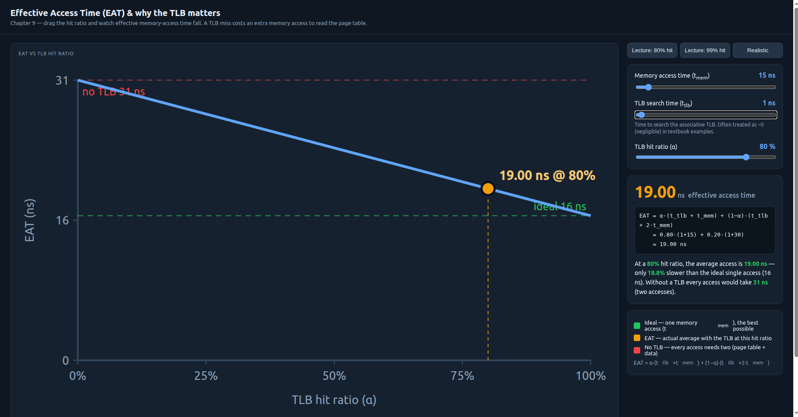
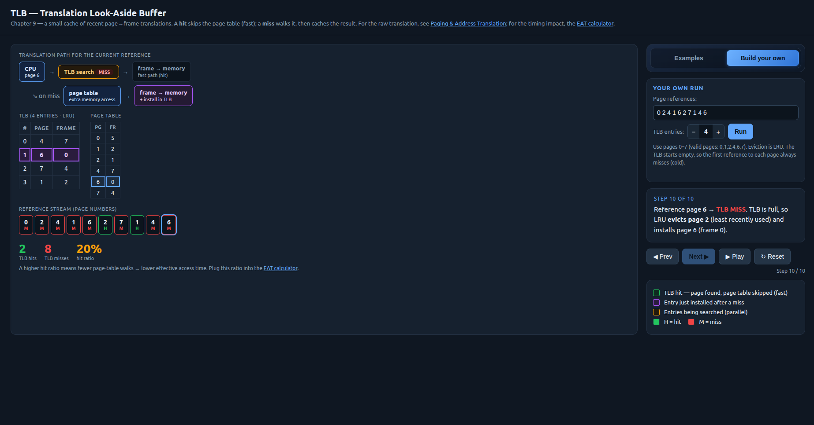
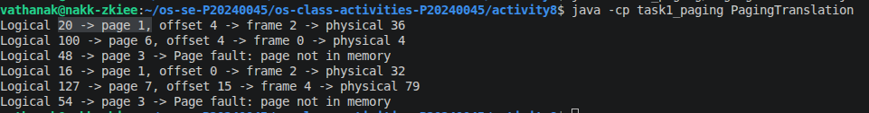
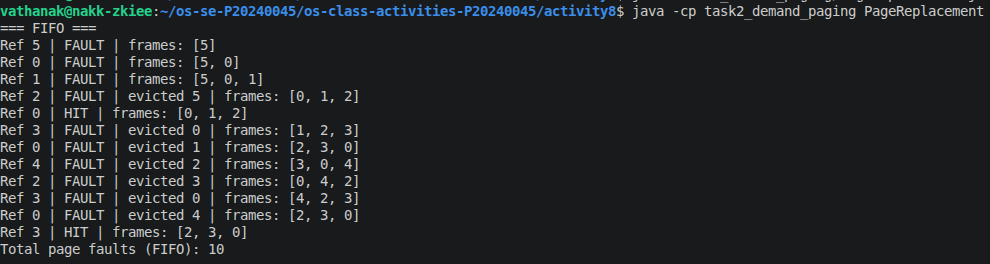
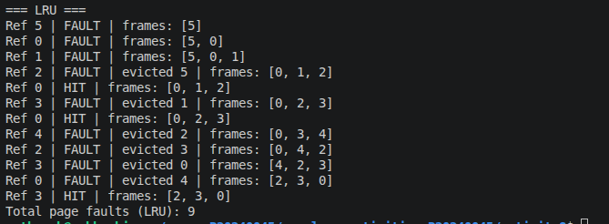

# Class Activity 8 - Memory Management & Virtual Memory

* **Student Name:** PI Sereyvathanak
* **Student ID:** P20240045
* **Personalization:** a = 5, b = 4 → N = (10a+b) mod 128 = 54
* **Programming Language Used:** Java

## Part 1A — Address Translation (by Hand)

| Logical (LA) | Page = LA/16 | Offset = LA%16 | Valid? | Frame | Physical Address |
| ------------ | ------------ | -------------- | ------ | ----- | ---------------- |
| 20           | 1            | 4              | Yes    | 2     | 36               |
| 100          | 6            | 4              | Yes    | 0     | 4                |
| 48           | 3            | 0              | No     | -     | Page Fault       |
| 16           | 1            | 0              | Yes    | 2     | 32               |
| 127          | 7            | 15             | Yes    | 4     | 79               |
| 54           | 3            | 6              | No     | -     | Page Fault       |

### Questions

1. **Offset unchanged because:**

   The offset identifies the exact byte within a page. Paging only changes the page number into a frame number; therefore the offset remains the same in both logical and physical addresses.

2. **Largest offset and bits required:**

   * Page size = 16 bytes
   * Largest offset = 15
   * Offset bits = log₂(16) = 4 bits

3. **Internal Fragmentation**

   * Process size = 60 + a = 60 + 5 = 65 bytes
   * Pages required = ceil(65 / 16) = 5 pages
   * Allocated memory = 5 × 16 = 80 bytes
   * Internal fragmentation = 80 − 65 = 15 bytes

## Part 1B — TLB & Effective Access Time (by Hand)

### My Page Reference Stream

Base stream:
1 2 4 1 6 2 7 1 4 6

a mod 8 = 5

Since page 5 is invalid, replace it with 0.

My stream:
0 2 4 1 6 2 7 1 4 6

### Prediction

I expected only a few hits because the TLB starts empty and the stream accesses more than four distinct pages.

### TLB Trace

| Ref | Hit/Miss | Page Table Read? | TLB After (LRU→MRU) | Evicted |
| --- | -------- | ---------------- | ------------------- | ------- |
| 0   | MISS     | Yes              | [0]                 | -       |
| 2   | MISS     | Yes              | [0,2]               | -       |
| 4   | MISS     | Yes              | [0,2,4]             | -       |
| 1   | MISS     | Yes              | [0,2,4,1]           | -       |
| 6   | MISS     | Yes              | [2,4,1,6]           | 0       |
| 2   | HIT      | No               | [4,1,6,2]           | -       |
| 7   | MISS     | Yes              | [1,6,2,7]           | 4       |
| 1   | HIT      | No               | [6,2,7,1]           | -       |
| 4   | MISS     | Yes              | [2,7,1,4]           | 6       |
| 6   | MISS     | Yes              | [7,1,4,6]           | 2       |

Measured hits = 2/10

α = 0.20

### Effective Access Time

t_mem = 10 + a = 15 ns

t_tlb = 1 ns

#### EAT at measured α

EAT = α(t_tlb + t_mem) + (1 − α)(t_tlb + 2t_mem)

= 0.20(1 + 15) + 0.80(1 + 30)

= 0.20(16) + 0.80(31)

= 3.2 + 24.8

= 28 ns

#### EAT at 80%

= 0.80(16) + 0.20(31)

= 12.8 + 6.2

= 19 ns

#### EAT at 99%

= 0.99(16) + 0.01(31)

= 15.84 + 0.31

= 16.15 ns

#### No TLB

= 1 + 2(15)

= 31 ns

### Why 99% Beats No-TLB

Percentage improvement:

((31 − 16.15) / 31) × 100

= 47.9%

A 99% hit ratio is about 47.9% faster because almost every translation avoids the extra page-table memory access.

## Part 1C — Paging Simulator Verification

* The simulator matched all calculations from Part 1A.
* The simulator correctly identified pages 3 as invalid and produced page faults.
* The optional TLB simulation reproduced the same hit ratio of 0.20 and EAT of 28 ns.

## Part 2A — Page Replacement (By Hand)

### My Reference String

a mod 7 = 5

Reference string:

5 0 1 2 0 3 0 4 2 3 0 3

### Prediction

I predicted that LRU would produce fewer page faults because it keeps recently used pages in memory.

### FIFO Results

FIFO faults: 10

### LRU Results

LRU faults: 9

### Conclusion

LRU generated fewer page faults than FIFO, which matched my prediction.

## Part 2B — Demand-Paging Simulator Verification

* The simulator produced the same page-fault totals as my hand calculations.
* FIFO = 10 faults
* LRU = 9 faults
* No corrections were needed.

## Part 3 — Applied Reasoning

### 1. Why is paging free of external fragmentation?

Paging divides memory into fixed-size pages and frames. Any free frame can store any page, so memory never becomes split into unusable gaps. Contiguous allocation requires one large continuous block, which can create external fragmentation.

### 2. Why does loading a page into an empty frame still count as a page fault?

The page is not currently in memory when it is referenced. The operating system must still load it from secondary storage, so a page fault occurs even if an empty frame is available.

### 3. Why does a 99% hit ratio matter so much?

At 80% hits, EAT is 19 ns. At 99% hits, EAT is only 16.15 ns. The remaining misses are expensive because each miss requires an extra memory access. Reducing misses significantly improves overall performance.

### 4. Why did FIFO and LRU differ?

LRU considers recent usage while FIFO only considers arrival order. When page 0 was reused several times, LRU kept it in memory, but FIFO eventually evicted it because it had been loaded earlier.

### 5. What is thrashing?

Thrashing occurs when the operating system spends most of its time swapping pages instead of executing instructions. With only one frame, almost every reference would cause a page fault, leading to a very high page-fault rate and poor TLB performance.

### 6. Benefit and risk of demand paging

Benefit: Memory is used efficiently because only needed pages are loaded.

Risk: The first access to a page may trigger a page fault, causing delays and reducing performance.
