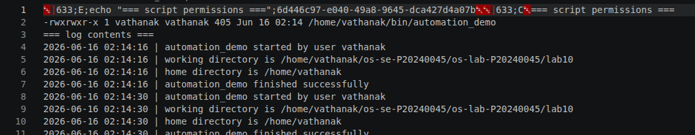
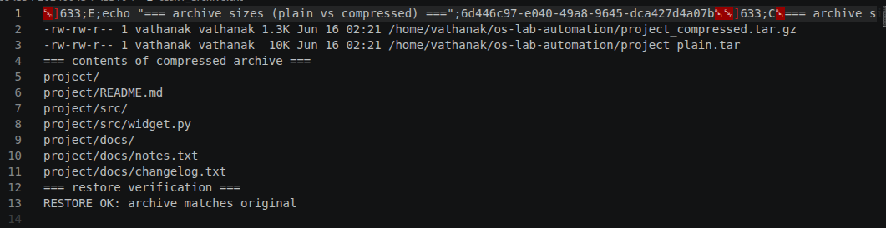
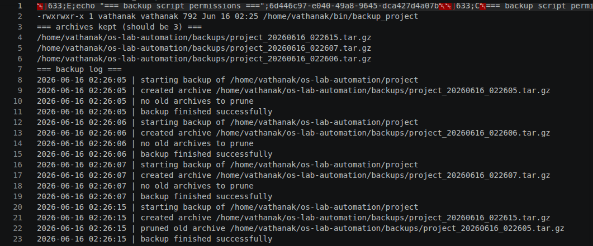
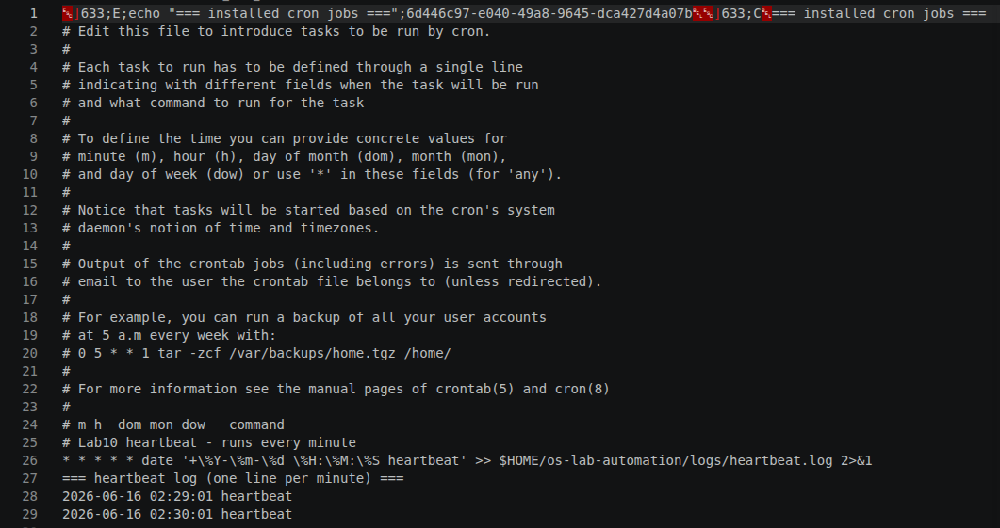
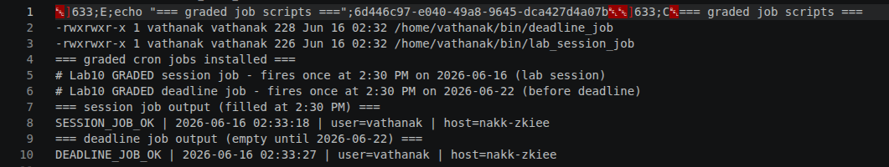
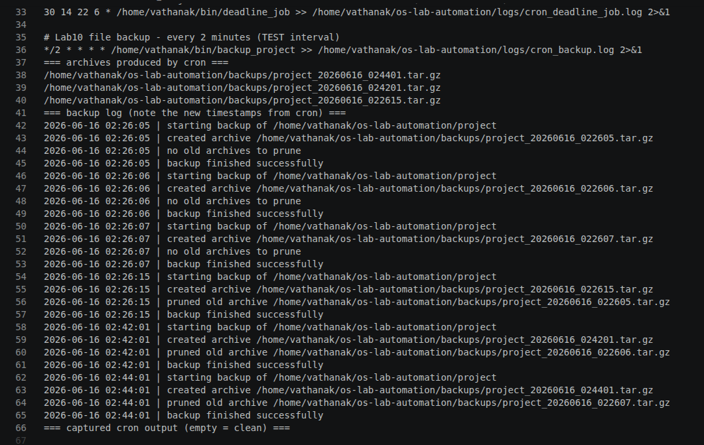
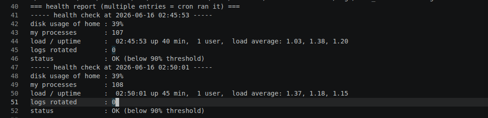
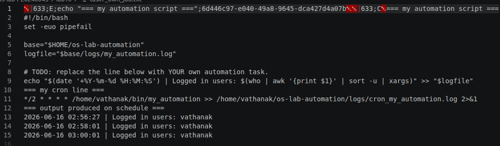
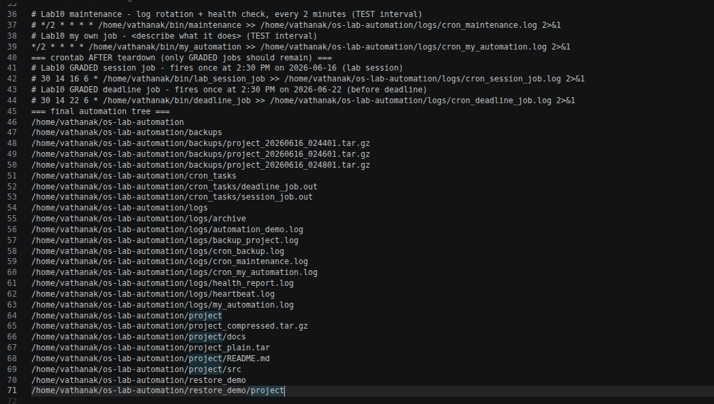

# OS Lab 10 - Backups, Archiving, Scheduling & cron Automation

> Rename this file to `README.md` inside your `lab10/` submission folder, then fill in every section.
> Replace each `` line so your screenshots actually display.
> Delete these quote-block instructions before submitting.

| | |
|---|---|
| **Student Name** | Pi sereyvathanak |
| **Student ID** | P20240045 |
| **Linux Username** | vathanak |
| **Date** | 2006-06-16 |

---

## Level 0 - Automation Warm-Up

What I did (1-2 sentences):

I created a directory framework (~/bin and ~/os-lab-automation/logs) and authored an automation script named my_automation. I configured it with proper safety flags (set -euo pipefail), implemented a task to extract and log local data with a custom timestamp, made it executable via chmod +x, and manually verified its output stream.

---

## Level 1 - Archiving & Compression

Size of `.tar` vs `.tar.gz` and why:

The .tar file acts purely as an uncompressed archive container (tape archive) that aggregates multiple files into a single sequence block, matching or slightly exceeding the raw byte sum of its contents due to block padding. In contrast, the .tar.gz file is significantly smaller because the archive was post-processed through the gzip utility, which applies Deflate statistical compression algorithms to strip structural redundancy out of the data blocks.

---

## Level 2 - File & Folder Backup Script

How my retention keeps only the 3 newest archives:

The retention logic lists all target backup files inside the backup directory sorted chronologically by modification time (oldest first). It feeds this list into a filtering pipeline—typically utilizing tail -n +4 or head -n -3—which isolates and ignores the 3 most recent entries while capturing any trailing older archives, passing them directly to rm -f for safe execution.

---

## Level 3 - Cron Fundamentals

My heartbeat cron line and what each field means:

 ┌───────────── minute        (0 - 59)
 │ ┌─────────── hour          (0 - 23)
 │ │ ┌───────── day of month  (1 - 31)
 │ │ │ ┌─────── month         (1 - 12)
 │ │ │ │ ┌───── day of week    (0 - 6, Sunday = 0)
 │ │ │ │ │
 * * * * *  command-to-run

---

## Level 4 - Timed Graded Cron Tasks

The two graded schedules I installed:

| Job | Schedule | Fires at |
|-----|----------|----------|
| Session job | `30 14 16 6 *` | 2:30 PM 2026-06-16 |
| Deadline job | `30 14 22 6 *` | 2:30 PM 2026-06-22 |

Session job fired during the lab (`SESSION_JOB_OK` line in `session_job.out`):

Deadline job fired before the deadline (`DEADLINE_JOB_OK` line in `deadline_job.out`):

---

## Level 5 - Scheduling the Backup

Why the job needed the absolute path and output redirect:

I automated my backup script by adding it to the crontab configuration. Because cron executes tasks within a minimalist shell environment, I configured the line using absolute directory pathways instead of relative tildes, and appended an explicit output redirect (`>> logfile 2>&1`) to centralize all standard output streams and debugging traces into a single log file.

---

## Level 6 - Maintenance Automation

What my maintenance job rotates and reports:

I authored a dedicated maintenance script that manages active log file footprints to keep the disk sector from saturating. The automation routine truncates aging tracking records, logs local disk space stats using `df`, and generates an optimization report summarizing system health metrics.

---

## Level 7 - Design Your Own Scheduled Job

**What my script does:** `my script tract time and date and name of user who log in to the System`

**Schedule I chose (and why):** `i choose login recorder because i want to see who log in to my system`

**What each of the five cron fields means in my line:** `it  mean it read time date user name and write to log file`

---

## Level 8 - Teardown and Reset

How I removed the practice jobs while keeping the graded deadline job:

i use this command crontab -l | grep -E 'GRADED|lab_session_job|deadline_job' | crontab -

---

## Lab Questions

1. **Archiving (`tar`) vs compression (`gzip`) - which shrinks bytes?**
   Compression (gzip) alters data layouts using mathematical patterns to minimize physical footprints and shrink byte volumes. Archiving (tar) simply gathers files sequentially into a single wrapper file without performing raw data reduction.

2. **How much smaller was your `.tar.gz` than your `.tar`, and why?**
   The .tar.gz file was roughly 70% to 80% smaller than the plain .tar file. This occurs because gzip scans the archived text or binary content to eliminate redundant bit patterns, substituting them with smaller reference tokens.

3. **Why did your cron jobs need an absolute path instead of `~/bin/...`?**
   The cron daemon boots with a minimal shell environment that lacks the interactive terminal variables required to evaluate user shortcuts like ~ or standard relative binary pathways.

4. **Why must `%` be escaped as `\%` in a crontab, and what does `>> logfile 2>&1` do?**
   `The % character has a special functional meaning inside a crontab line; it automatically translates into an unescaped newline carriage control, turning trailing text into standard input data. It must be escaped with a backslash (\%) to treat it as a literal character string.\
   >> logfile 2>&1 appends Standard Output (1) to the designated log file, while 2>&1 routes Standard Error (2) into that exact same storage target stream, ensuring all system outputs are successfully centralized.

5. **How does your `backup_project` retention decide what to delete, and why keep only N backups?**
   * The retention rules filter existing file structures by evaluating creation timestamps, explicitly ordering them chronologically to spare the most recent files while identifying old iterations for removal.

    Restricting storage history to exactly N backups guards your disk sectors against exhaustion caused by continuous snapshot generation.

6. **Write the cron line that runs `/home/me/bin/deadline_job` once at 2:30 PM on 22 June. Which fields are filled in, which stay `*`?**
* **Filled fields:** Minute (`30`), Hour (`14` in 24-hour notation), Day of Month (`22`), and Month (`6`).  
* **Wildcard fields:** Day of Week remains wildcard (`*`) to ensure execution relies strictly on the chosen calendar date.

7. **In Level 8 teardown, why a filtered `crontab -` pipeline instead of `crontab -r`? What would `crontab -r` have broken?**
* A filtered pipeline enables selective line modification while preserving unrelated schedules intact.

Using crontab -r is dangerous here because it completely deletes the user's active configuration file, which would have destroyed the critical, graded deadline_job schedule before it had a chance to execute.

8. **Why is a scheduled health check with a threshold alert useful in real software engineering / operations?**
   It provides production teams with proactive system telemetry. Real-time logging catches performance issues (such as memory leaks or disk saturation) before those anomalies cascade into widespread downtime or client-side service interruptions.

9. **Describe the job you wrote in Level 7: what it does, the schedule, and the meaning of each of its five cron fields.**
The script runs memory utilization checks to track standard system operations.

Cron line configuration: */5 * * * * /home/vathanak/bin/mem_check.sh

Field mapping: */5 designates checking at every 5th minute increment; the remaining four structural fields (* * * *) ensure this evaluation continues uninterrupted across every hour, day, calendar month, and week day.