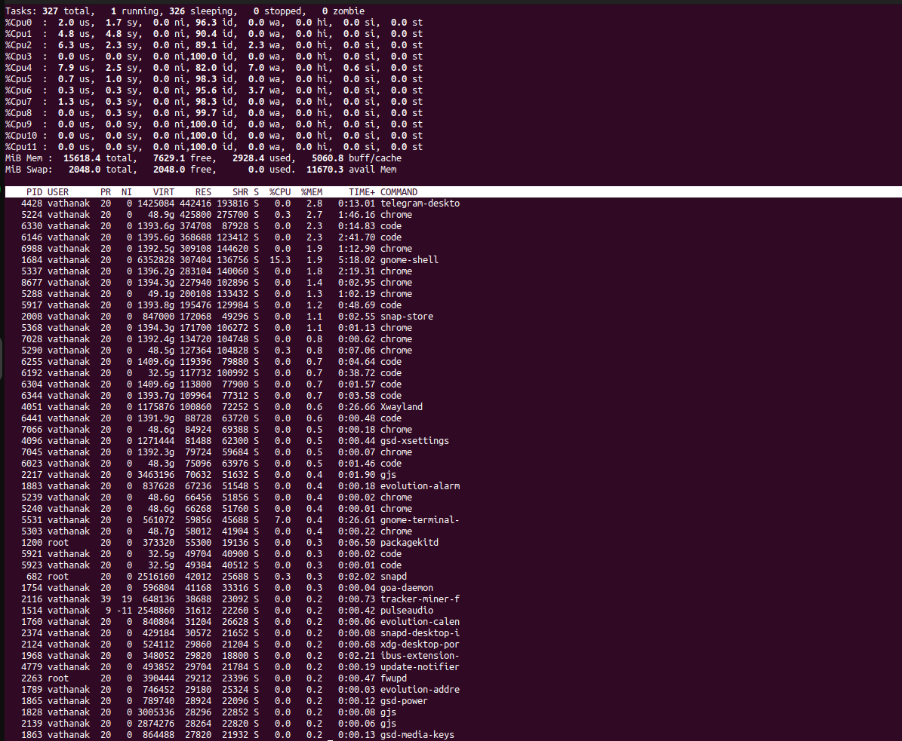
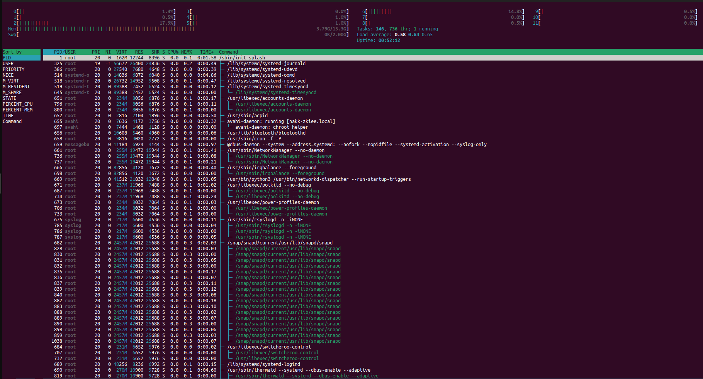
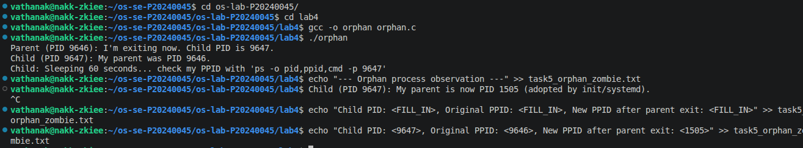
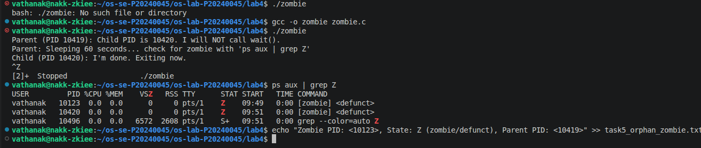

# Lab 4 — I/O Redirection, Pipelines & Process Management

| | |
|---|---|
| **Student Name** | Pi sereyVathanak |
| **Student ID** | `P20240045 |

## Task Completion

| Task | Output File | Status |
|------|-----------|--------|
| Task 1: I/O Redirection | `task1_redirection.txt` | ☐ |
| Task 2: Pipelines & Filters | `task2_pipelines.txt` | ☐ |
| Task 3: Data Analysis | `task3_analysis.txt` | ☐ |
| Task 4: Process Management | `task4_processes.txt` | ☐ |
| Task 5: Orphan & Zombie | `task5_orphan_zombie.txt` | ☐ |

## Screenshots

### Task 4 — `top` Output

### Task 4 — `htop` Tree View

### Task 5 — Orphan Process (`ps` showing PPID = 1)

### Task 5 — Zombie Process (`ps` showing state Z)

## Answers to Task 5 Questions

1. **How are orphans cleaned up?**
   Orphan processes are adopted by init/systemd (PID 1), which later calls wait() to clean them up.

2. **How are zombies cleaned up?**
   Zombies are cleaned when the parent calls wait() or waitpid(); if the parent dies, init/systemd adopts and cleans them.

3. **Can you kill a zombie with `kill -9`? Why or why not?**
   No, because a zombie is already dead and only exists in the process table; signals have no effect.

## Reflection

The most useful technique I learned in this lab was the use of pipelines (|) combined with filters such as grep, sort, and wc. These tools allow efficient processing of large amounts of data directly from the command line without needing additional programs. For example, being able to quickly extract specific information from log files or count occurrences of certain patterns is extremely powerful.

I also found I/O redirection (>, >>, <) very practical, as it enables saving outputs to files, which is essential for documentation, debugging, and automation. Instead of manually copying results, commands can directly generate structured output files.

In a real server environment, pipelines and redirection would be highly valuable for tasks such as monitoring system performance, analyzing logs, and automating routine operations. For instance, an administrator could combine commands to filter error logs, summarize usage statistics, or back up important data efficiently. Overall, these techniques improve productivity, reduce manual work, and support better system management.