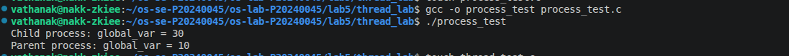
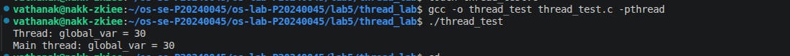
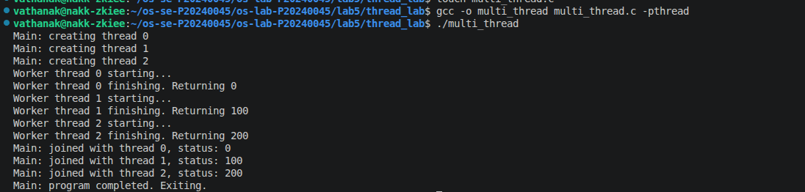
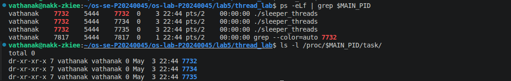
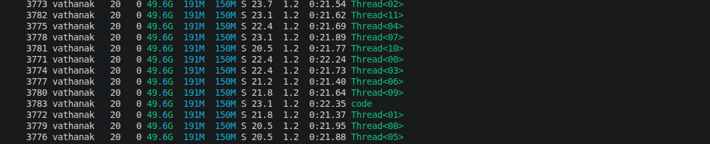
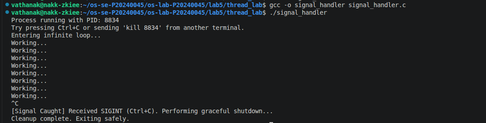
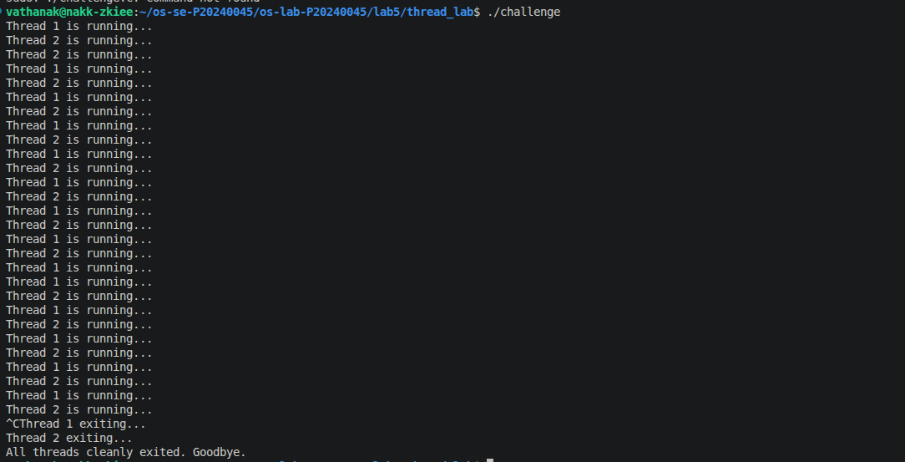

# OS Lab 5 Submission — Threads, Kernel Workers & Process Signals

- **Student Name:** Pi ssereyVathanak
- **Student ID:** p20240045

---

## Task Output Source Files

Make sure all of the following files are present in your `lab5/thread_lab/` folder:

- [ ] `process_test.c`
- [ ] `thread_test.c`
- [ ] `multi_thread.c`
- [ ] `sleeper_threads.c`
- [ ] `signal_handler.c`
- [ ] `challenge.c`

---

## Screenshots

Insert your screenshots below.

### Screenshot 1 — Task 1: Process vs Thread (Process Test)
Show the output of `process_test.c`.
<!-- Insert your screenshot below: -->

---

### Screenshot 2 — Task 1: Process vs Thread (Thread Test)
Show the output of `thread_test.c`.
<!-- Insert your screenshot below: -->

---

### Screenshot 3 — Task 2: Thread Interaction
Show the output of `multi_thread.c`.
<!-- Insert your screenshot below: -->

---

### Screenshot 4 — Task 3: Visualizing 1:1 Thread Mapping
Show the `ps -eLf` output or `/proc/[pid]/task/` directory visualizing the LWP mapping for user threads.
<!-- Insert your screenshot below: -->

---

### Screenshot 5 — Task 3: `htop` Kernel Threads
Show `htop` visualizing kernel threads (usually bracketed names like `[kworker]`).
<!-- Insert your screenshot below: -->

---

### Screenshot 6 — Task 4: Catching `SIGINT`
Show the output of your `signal_handler` program gracefully catching `Ctrl+C`.
<!-- Insert your screenshot below: -->

---

### Screenshot 7 — Challenge: Graceful Multithreaded Shutdown
Show the output of your `challenge.c` program joining its threads and exiting gracefully after receiving `Ctrl+C`.
<!-- Insert your screenshot below: -->

---

## Answers to Lab Questions

1. **Why do threads share memory while processes do not (by default)?**
hreads are created within the same process and therefore operate inside a single virtual address space. This means they share:

heap
global variables
code (text segment)

Each thread only has its own:

stack
registers
thread-local storage

In contrast, processes are isolated by the OS using separate virtual memory spaces enforced by the MMU (Memory Management Unit). This isolation prevents unintended interference and improves security. Inter-process communication (IPC) is required for processes to exchange data, whereas threads can communicate directly via shared variables.

2. **Based on the 1:1 mapping, what is the role of an LWP (Lightweight Process) in Linux?**
In Linux’s 1:1 threading model, each user-level thread maps directly to a kernel entity called a Lightweight Process (LWP).

The LWP:

is the schedulable unit managed by the kernel scheduler
represents a thread at the kernel level
has its own kernel stack and execution context
allows true parallel execution on multiple CPU cores

So effectively, when you create a thread using pthread_create, the kernel creates a corresponding LWP that the scheduler runs independently.

3. **Why is it restricted to send signals to kernel threads (e.g., `kthreadd` or `kworker`)?**
Kernel threads operate entirely in kernel space and are responsible for critical system tasks (e.g., memory management, I/O handling).

Allowing arbitrary signals to them would:

risk system instability or crashes
interfere with critical kernel operations
violate privilege boundaries between user space and kernel space

Therefore, the OS restricts signal delivery to kernel threads to maintain system integrity and security. Only controlled kernel mechanisms can manage or terminate them.

4. **Why can't `SIGKILL` (kill -9) be caught by a signal handler?**
IGKILL is designed as a non-maskable, non-catchable signal to guarantee that a process can always be terminated.

If it could be caught or ignored:

a misbehaving or malicious process could refuse to terminate
system administrators would lose ultimate control over processes

Thus, the kernel enforces immediate termination upon receiving SIGKILL, bypassing:

signal handlers
cleanup routines
user-space control

---

## Reflection

> _What was the most challenging part of managing threads and signals in this lab? How do you think these concepts apply to large-scale applications like web servers or databases?_

The most challenging part of this lab is coordinating asynchronous signals with concurrent threads. Signals can arrive at any time, which introduces race conditions when multiple threads access shared variables like a termination flag. Ensuring safe communication between the signal handler and threads (e.g., using volatile sig_atomic_t) requires careful attention to concurrency rules.

Another difficulty is understanding that signals are typically delivered to a process, but may be handled by one thread, which complicates reasoning about behavior in multithreaded programs.

In large-scale systems like web servers or databases, these concepts are critical. Threads are used to handle multiple client requests concurrently, while signals are often used for:

graceful shutdown (e.g., SIGINT, SIGTERM)
reloading configurations
managing worker processes

A well-designed system must ensure:

clean resource deallocation
no data corruption during shutdown
proper synchronization between threads

This lab reflects real-world challenges in building reliable, concurrent systems.