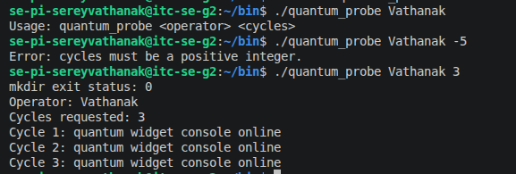
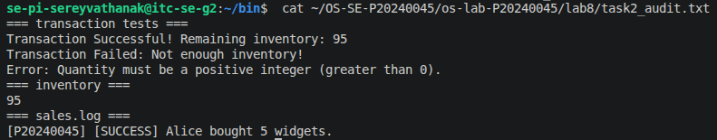
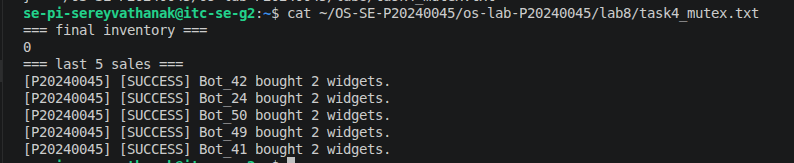
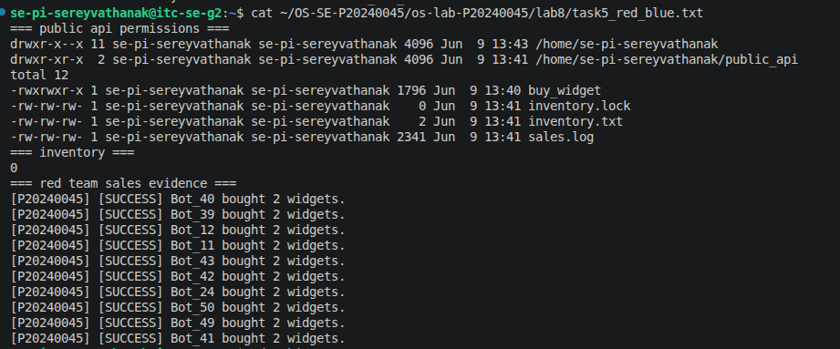
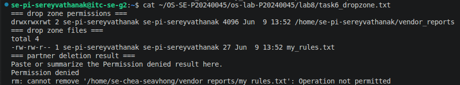
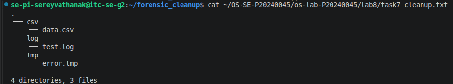

# OS Lab 8 Submission - The Quantum Widget Exploit

- **Student Name:** [Your Name Here]
- **Student ID:** [Your Student ID Here]
- **Partner Username:** [Classmate username for Levels 5-6]

---

## Task Output Files

Make sure all of the following files are present in your `lab8/` folder:

- [ ] `observations.txt`
- [ ] `task0_warmup.txt`
- [ ] `task1_validation.txt`
- [ ] `task2_audit.txt`
- [ ] `task4_mutex.txt`
- [ ] `task5_red_blue.txt`
- [ ] `task6_dropzone.txt`
- [ ] `task7_cleanup.txt`
- [ ] `scripts/arg_viewer`
- [ ] `scripts/quantum_probe`
- [ ] `scripts/buy_widget`
- [ ] `scripts/bot_swarm`
- [ ] `scripts/create_dropzone`
- [ ] `scripts/cleanup`

---

## Screenshots

Insert your screenshots below.

### Screenshot 1 - Level 0: Bash Warm-Up Scripts
Show `arg_viewer` explaining `$0`, `$1`, `$2`, `$#`, and `$?`, then show `quantum_probe` using a condition and a loop.

---

### Screenshot 2 - Level 2: Audit Trails
Show input validation, a successful sale, failed transactions, final inventory, and `sales.log`.

---

### Screenshot 3 - Level 4: Mutex Patch
Show `inventory.txt` exactly `0` after the patched `bot_swarm`, plus the last five lines of `sales.log`.

---

### Screenshot 4 - Level 5: Red Team vs. Blue Team
Show `public_api` permissions, inventory, and sales log evidence that your classmate executed your API.

---

### Screenshot 5 - Level 6: Secure Drop Zone
Show the sticky bit in `ls -ld` output and evidence that your partner could not delete your file.

---

### Screenshot 6 - Level 7: Forensic Cleanup
Show `tree` or `ls -R` output proving `.log`, `.csv`, and `.tmp` files were sorted into folders.

---

## Race Condition Observations

Summarize your five vulnerable `bot_swarm` runs from `observations.txt`:

| Run | Final Inventory | Notes |
|:---:|----------------:|-------|
| 1 | 80 | Race condition |
| 2 | 76 | Race condition |
| 3 | 88 | Race condition |
| 4 | 92 | Race condition |
| 5 | 82 | Race condition |

---

## Answers to Lab Questions

1. **In `arg_viewer`, what did `$0`, `$1`, `$2`, `$#`, and `$?` mean when you ran the script?**
   $0: The name or path of the script currently being executed (e.g., scripts/arg_viewer).

    $1 and $2: The first and second positional arguments passed to the script from the command line.
    
    $#: The total number of arguments passed to the script.

    $?: The exit status of the last executed foreground command (where 0 usually means success and non-zero means an error).

2. **What does TOC-TOU mean, and where did it appear in the vulnerable `buy_widget` script?**
   TOC-TOU stands for Time-of-Check to Time-of-Use. It is a class of software bug caused by a race condition where a system resource (like a file) is checked, but the resource changes before it is actually used.In the vulnerable buy_widget script, this occurred between the Check (reading inventory.txt to see if stock was $> 0$) and the Use (subtracting 1 and writing the new value back to inventory.txt).

3. **Why did `bot_swarm` sometimes leave inventory values other than `0` before the patch?**
   Because the OS scheduler context-switches between concurrent processes. Before the patch, multiple instances of buy_widget read the exact same inventory value from the file before any of them could write an update back.For example, if inventory was at 50, three bots might read "50" at the same time. They all calculate $50 - 1 = 49$, and they all write "49" back to the file. Instead of losing 3 items, the inventory only dropped by 1. This "lost update" problem prevents the inventory from hitting 0.

4. **What part of the script is the critical section, and why must it be protected?**
   The critical section encompasses the code from the moment inventory.txt is read, evaluated, decremented, up until the new value is completely written back to the file.

It must be protected because it accesses a shared global resource (inventory.txt) via a read-modify-write sequence. If multiple processes interleave inside this section, data corruption and race conditions occur.

5. **How does `flock -x` enforce mutual exclusion between concurrent processes?**
   flock -x manages an exclusive advisory lock on a designated lockfile. When a process attempts to execute code protected by flock, the operating system kernel ensures that only one process can hold that file descriptor lock at any given moment. Any subsequent processes trying to grab the lock are forced to wait in a blocked state until the holding process releases it, ensuring strictly serialized access to the critical section.

6. **Which permissions did you use to let a classmate run your API without giving full access to your home directory?**
   Execute-only permissions (--x or 1) were given to the world/group on the home directory and intermediate folders, which allows a user to pass through directories to hit a target file if they know the exact path, but prevents them from listing (r) the directory contents. The actual API script was given read and execute permissions (r-x or 5) to allow execution.

7. **Why does the sticky bit protect files in a shared drop zone?**
   Ordinarily, if a user has write permission on a directory, they can delete any file inside it, regardless of who owns the file.

Applying the sticky bit (+t or 1777 permissions) alters this behavior: it restricts file deletion and renaming inside that directory exclusively to the file's owner, the directory's owner, or the root user. Your partner can create files in your dropzone, but they cannot malicious delete or overwrite yours.

8. **What defensive scripting practice from this lab would you use in a real production script?**
  Implementing atomic file operations using file locks (flock) to prevent multi-process data corruption, alongside strict input validation checking (ensuring arguments match strict type constraints before treating them as integers or file paths).

---

## Reflection

> _What did this lab teach you about the relationship between Bash scripts, OS scheduling, file permissions, and secure concurrent access?_
This lab highlights the gaps that exist between isolated user-space code and kernel-level scheduling. I learned that just because a Bash script executes sequentially on a single line-by-line basis, it does not mean it is safe from concurrent hazards when scaled out. The OS scheduler can swap a process out at any clock tick, exposing vulnerable "Check-then-Act" logic if shared file systems are not explicitly locked.

Furthermore, setting up the drop zone and public API underscored that secure systems require a defense-in-depth approach. We cannot rely solely on code-level safety; we must leverage OS-enforced mechanisms like the sticky bit, proper POSIX permission bits, and kernel-level mutual exclusion primitives to maintain data integrity and system security.